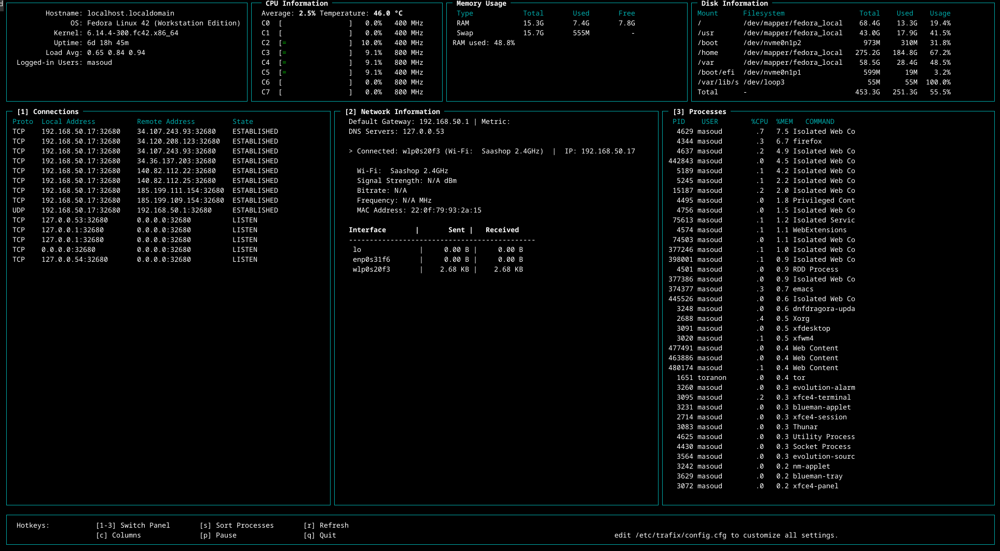

<!-- SPDX-License-Identifier: GPL-3.0-or-later -->
<!-- Copyright (C) 2025 Masoud Bolhassani -->



# Trafix

**Trafix** - A Lightweight Linux Monitoring Tool

Trafix is a high-performance, user-friendly monitoring tool for Linux systems. It enables real-time tracking of active network connections and provides insights into top traffic sources, all via a streamlined command-line interface.

## Key Features:

- **Monitor Active Connections:** View detailed information about all active TCP/UDP connections, including local and remote addresses, ports, and connection states.
- **Track Bandwidth Usage:** Monitor both incoming and outgoing network traffic in real-time.
- **Alerts & Thresholds:** Set custom thresholds for network usage and receive notifications when these limits are exceeded.
- **User-Friendly CLI:** A simple and intuitive command-line interface with filtering, sorting, and customizable options for tailored monitoring.

Trafix is designed to be lightweight, efficient, and to use minimal system resources, making it an ideal tool for monitoring network activity on Linux-based systems.

## Installation and Usage:

### Install from Source

To install Trafix from the source, follow these steps:

1. Clone the repository:

    ```sh
    git clone https://github.com/msoodb/trafix.git
    cd trafix
    ```

2. Build and install:

    ```sh
    make clean
    make
    sudo make install
    ```

3. After installation, you can run Trafix with:

    ```sh
    bin/trafix
    ```

### Install from Fedora Repository

1. If you're using Fedora or a compatible distribution, you can install Trafix directly from the Fedora repository:

	```sh
	sudo dnf install trafix
	```

2. After installation, run Trafix with:
	```sh
	trafix
	```

