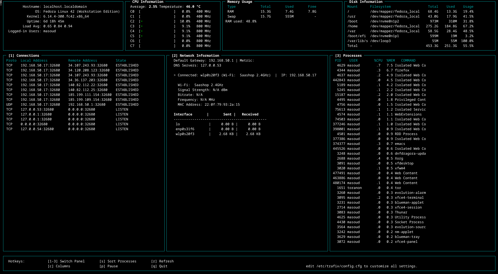

<!-- SPDX-License-Identifier: GPL-3.0-or-later -->
<!-- Copyright (C) 2025 Masoud Bolhassani -->



# Trafix

**Trafix** - A Lightweight Linux Monitoring Tool

Trafix is a lightweight terminal monitoring tool for Linux systems. It provides an interactive TUI for system, process, connection, and network visibility, plus scriptable CLI commands for interface counters, connections, and system overview data.

## Table of Contents

- [Key Features](#key-features)
- [Installation and Usage](#installation-and-usage)
  - [Install from Source](#install-from-source)
  - [Install from Fedora Repository](#install-from-fedora-repository)
  - [Debian and Ubuntu Packaging](#debian-and-ubuntu-packaging)
- [User Manual](#user-manual)
  - [Hotkeys](#hotkeys)
  - [Configuration](#configuration)
    - [Example Configuration File](#example-configuration-file)
    - [Configuration Options](#configuration-options)
- [Operator Guide](#operator-guide)
- [Roadmap](#roadmap)

## Key Features:

- **Monitor Active Connections:** View detailed information about all active TCP/UDP connections, including local and remote addresses, ports, and connection states.
- **Network Overview:** See route, DNS, VPN, and active interface clues in one compact panel.
- **Socket Inventory Drill-Down:** Inspect owned sockets with PID, process, and endpoint context.
- **Bandwidth Top Talkers:** See the most active sockets or processes and open a detail view for the selected entry.
- **Recent Trend History:** Review short sample-based history lines in the Network panel to spot sudden change.
- **Track Interface Activity:** Monitor interface-level sent/received byte rates from Linux interface counters.
- **Socket Owners:** Map visible sockets to owning PID/process where available.
- **Diagnostics Snapshot:** Export a compact troubleshooting snapshot with system,
  network, log, and pressure context.
- **Scriptable CLI:** Print interface counters, active connections, and system overview data in text or JSON format.

Trafix is designed to be lightweight, efficient, and to use minimal system resources, making it an ideal tool for monitoring network activity on Linux-based systems.

## Bandwidth Scope

Trafix now estimates bandwidth from interface counters and visible ownership metadata. The Network panel shows top talkers and a short recent trend, and the detail popup lets you inspect the selected flow with its current metadata and history. Where ownership data is missing, the UI keeps the fallback explicit instead of pretending exact per-socket accounting.

## Build Requirements

- Linux
- C compiler such as `gcc`
- `make`
- ncurses development package

Optional runtime tools that improve some panels:

- `lm_sensors` for CPU temperature data
- `iw` for Wi-Fi details
- `iproute2` for route information
- `procps` for process listings

## Installation and Usage:

### Install from Source

To install Trafix from the source, follow these steps:

1. Clone the repository:

    ```sh
    git clone https://github.com/msoodb/trafix.git
    cd trafix
    ```

2. Build and install:

    ```sh
    make clean
    make
    sudo make install
    ```

3. After installation, you can run Trafix with:

    ```sh
    trafix
    ```

    When running from the source tree without installing, use:

    ```sh
    bin/trafix
    ```

### Command-line Usage

Launch the Trafix TUI:

```sh
trafix
```

Show help:

```sh
trafix --help
```

Show version information:

```sh
trafix --version
```

Print network interface counters:

```sh
trafix interfaces
trafix interfaces --json
```

Print active TCP/UDP connections:

```sh
trafix connections
trafix connections --json
trafix connections --proto tcp
trafix connections --state ESTABLISHED
```

Request a process kill or socket drop from the CLI:

```sh
trafix kill 1234 --yes
trafix drop connection tcp 127.0.0.1:8080 10.0.0.2:443 --yes
trafix drop socket udp 0.0.0.0:53 0.0.0.0:0 --yes
```

Print local listeners:

```sh
trafix listeners
trafix listeners --json
```

Print a compact system overview:

```sh
trafix system
trafix system --json
```

Print a troubleshooting snapshot:

```sh
trafix diagnostics
```

CLI commands use text output by default. Use `--json` when integrating Trafix with scripts or other tools.
Destructive actions require confirmation. The TUI always asks before a kill or
drop action runs. The CLI requires `--yes` for non-interactive execution and
reports permission or unsupported-target failures explicitly.

### Install from Fedora Repository
> This installation method is under development and not yet ready for use.

1. If you're using Fedora or a compatible distribution, you can install Trafix directly from the Fedora repository:

	```sh
	sudo dnf install trafix
	```

2. After installation, run Trafix with:
	```sh
	trafix
	```

### Debian and Ubuntu Packaging

Debian and Ubuntu packages are not available yet. See
`docs/debian_packaging.md` for the current packaging roadmap and dependency
notes.

## User Manual

Trafix offers an interactive command-line interface with real-time controls. You can manage views, sorting, and behavior using the following keyboard shortcuts:

For release and regression checks, use the manual TUI checklist in
`docs/tui_manual_test_checklist.md`.

The dashboard is arranged as a primary column for the core observability
views and a support column for logs, diagnostics, audits, and other supporting
live data. On narrow terminals, Trafix collapses that support column
automatically.

### Hotkeys

- `[F1]`, `[h]`, `[H]` — **Help Popup:** Show the hotkey help popup.
- `[d]`, `[Enter]` — **Bandwidth Detail:** Open the selected top-talker detail popup.
- `[j]`, `[k]` — **Move Selection:** Move the selected top talker up or down.
- `[Esc]`, `[Enter]`, `[q]` — **Close Popup:** Dismiss the hotkey popup.
- `[x]` — **Kill Process:** Open a process chooser and confirm a kill action.
- `[z]` — **Drop Connection:** Open a connection chooser and confirm a drop action where supported.
- `[a]` — **Action Audit:** Show the recent action trail popup.
- `[g]` — **Diagnostics:** Show the troubleshooting snapshot popup.
- `[n]` — **Route/DNS Checks:** Show the route and DNS correlation popup.
- `[v]` — **Network Health:** Show the network and system pressure correlation popup.
- `[s]` — **Sort Processes:** Change the sorting order of process information.
- `[r]` — **Refresh:** Force a manual refresh of all panels.
- `[c]` — **Primary Module:** Change the main module shown in the primary column.
- `[t]` — **Top Panels:** Show or hide the top system, CPU, memory, and disk panels.
- `[p]` — **Pause:** Pause/resume real-time updates.
- `[q]` — **Quit:** Exit the Trafix application.

### Configuration

All default settings can be customized by editing the configuration file:

```sh
sudo nano /etc/trafix/config.cfg
```

### Example Configuration File
```
# config/config.cfg

# SPDX-License-Identifier: GPL-3.0-or-later
# Copyright (C) 2025 Masoud Bolhassani.


TEMP_WARN_YELLOW = 50
TEMP_WARN_RED = 75

SHOW_TOP_PANELS = 1
TUI_REFRESH_INTERVAL_MS = 1000
TUI_PAUSE_INTERVAL_MS = 100
TUI_READY_CHECK_INTERVAL_MS = 10
TUI_SMALL_PANEL_REFRESH_MS = 2000
```

### Configuration Options

- **TEMP_WARN_YELLOW** *(default: 50)*  
  Temperature threshold in °C that triggers a yellow warning in the UI, indicating a moderate temperature.

- **TEMP_WARN_RED** *(default: 75)*  
  Temperature threshold in °C that triggers a red warning in the UI, indicating a high or dangerous temperature.

- **SHOW_TOP_PANELS** *(default: 1)*  
  Controls whether the top system, CPU, memory, and disk panels are shown.

- **TUI_REFRESH_INTERVAL_MS** *(default: 1000)*  
  Standard refresh cadence for TUI panels, in milliseconds.

- **TUI_PAUSE_INTERVAL_MS** *(default: 100)*  
  Sleep cadence while the TUI is paused, in milliseconds.

- **TUI_READY_CHECK_INTERVAL_MS** *(default: 10)*  
  Startup wait cadence while worker threads wait for the TUI runtime to become ready, in milliseconds.

- **TUI_SMALL_PANEL_REFRESH_MS** *(default: 2000)*  
  Refresh cadence for small-window fallback messages, in milliseconds.

After modifying the configuration, simply exit and run Trafix again to apply the changes:

## Operator Guide

For a short workflow-oriented guide to observe, drill down, act, and diagnose,
see [`docs/operator_guide.md`](docs/operator_guide.md).

## Roadmap

The long-term plan lives in [`docs/roadmap.md`](docs/roadmap.md). The
phase-by-phase task lists live under [`taklists/`](taklists/).
